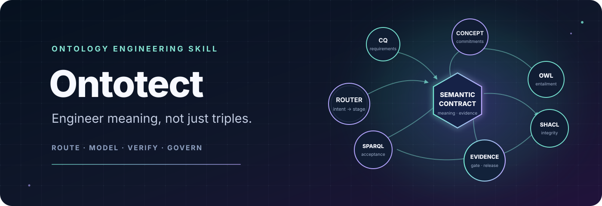
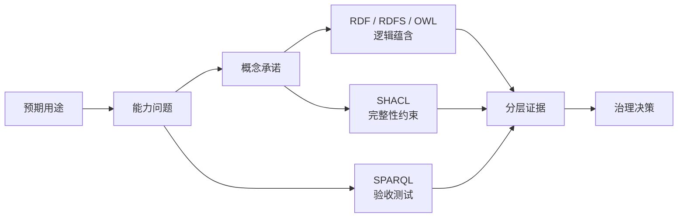
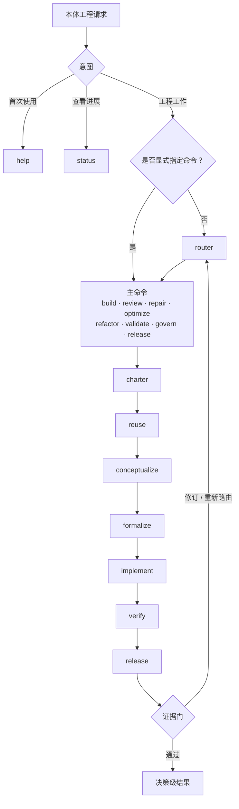

  
  <h1>Ontotect</h1>
  
<strong>Ontology Engineering Skill Suite · 本体工程技能体系</strong>

  
<em>工程化语义，而不只是生成三元组。</em>

  

    
    
    
    
  

  

    
    
  

  
<a href="README.md">English</a> · <a href="README.zh-CN.md">简体中文</a>

  

    <strong>面向 Coding Agents、以证据驱动的本体工程技能体系。</strong> 
    通过显式阶段与决策级证据，路由、设计、构建、审核、修正、优化、 
    重构、验证和治理本体。
  

  

    <a href="#install-in-60-seconds"><strong>安装 Ontotect</strong></a> ·
    <a href="#commands-for-different-scenarios">查看命令</a> ·
    <a href="docs/zh-CN/index.md">阅读文档</a>
  

---

> [!NOTE]
> **公开预览版。** Moonweave AI 组织包
> [`@moonweave-ai/ontotect`](https://www.npmjs.com/package/@moonweave-ai/ontotect)
> 已发布。稳定版发布前，命令契约和文档仍可能继续演进；已执行检查及其边界记录在
> [验证记录](docs/zh-CN/verification-record.md)中。

> [!IMPORTANT]
> `0.1.2` 提供完整的 20-entry discovery 修复。如果此前安装了 `0.1.1`，请升级 package，
> 使用 `--force` 重新运行 installer，并刷新或重新打开 Agent 宿主。

Ontotect 由 20 个可独立发现的 focused skills 与一套 canonical 本体工程工作流构成。
它把本体需求转化为经过路由、分阶段并持续产生证据的工作流：从能力问题和
概念承诺推进到 RDF/OWL/SHACL/SPARQL 制品、回归证据、语义影响以及可问责的发布决策。

## 60 秒安装

先查看 20 个 focused entries，再让显式安装器指向需要接收它们的目标项目。运行前请替换
示例目标路径：

~~~powershell
npx @moonweave-ai/ontotect list
npx @moonweave-ai/ontotect plan --agents all --scope project --project-root C:\path\to\target-project
npx @moonweave-ai/ontotect install --agents all --scope project --project-root C:\path\to\target-project
~~~

默认的 `--suite full` 会安装 `ontotect-help`、`ontotect-router`、全部工程模式和全部
生命周期阶段 skills；Kilo 与 OpenCode 还会获得同名 Markdown command adapters。只有在
明确希望保留单一 Router 时，才使用 `--suite core --commands none`。

按需重新加载宿主或新建会话后，使用各宿主支持的调用方式：

| 宿主 | 帮助 | focused 审核 |
|---|---|---|
| Codex CLI / IDE | `$ontotect-help` 或 `/skills` | `$ontotect-review` |
| Cursor | `/ontotect-help` | `/ontotect-review` |
| Claude Code | `/ontotect-help` | `/ontotect-review` |
| Kilo | 通过生成的 command adapter 使用 `/ontotect-help` | 通过 adapter 使用 `/ontotect-review` |
| OpenCode | 通过生成的 command adapter 使用 `/ontotect-help` | 通过 adapter 使用 `/ontotect-review` |

不清楚正确模式时，使用 `/ontotect-router <目标>`；Codex 中使用
`$ontotect-router`。可移植的自然语言回退形式仍然是：

~~~text
Use Ontotect. Command: review. Target: path/to/ontology.ttl.
~~~

### 安装全局命令

安装 organization-scoped package 以提供 `ontotect` shell 命令，再显式安装到选定的
Agent roots：

~~~powershell
npm install --global @moonweave-ai/ontotect
ontotect help
ontotect list
ontotect install --agents cursor,codex --scope project --project-root C:\path\to\target-project
~~~

从源码 checkout 安装时，改用 `npm install --global .`。

### 源码与 dry-run 工作流

在源码 checkout 中，可以直接运行 Node 入口；也可以先用 Python installer 预览，
确认后再应用安装：

~~~powershell
node bin/ontotect.js help
node bin/ontotect.js list
node bin/ontotect.js plan --agents all --scope project --project-root C:\path\to\target-project
node bin/ontotect.js install --agents all --scope project --project-root C:\path\to\target-project
python ontotect/scripts/install_skill.py --agents all --scope project --project-root C:\path\to\target-project
python ontotect/scripts/install_skill.py --agents all --scope project --project-root C:\path\to\target-project --apply
~~~

完整命令契约见 [npm 与 npx 安装](docs/zh-CN/npm-and-npx-installation.md)，宿主
目录与覆盖规则见[安装](docs/zh-CN/installation.md)，完整首次使用流程见
[开始使用](docs/zh-CN/getting-started.md)。

## Ontotect 是什么

Ontotect 是封装为可发现 Agent Skill Suite 的工程工作流，提供：

- 面向 Router、Help、Status、工程模式与生命周期阶段的 20 个 focused skills；
- 面向不同本体场景的显式命令路由；
- 从 charter 到 release 的阶段化生命周期；
- 面向 RDF、RDFS、OWL 2、SKOS、SHACL、SPARQL、映射、模块和溯源的建模与
  决策指导；
- 渐进式、按需加载的参考资料，而不是一份超大提示词；
- 可复用的项目简报、能力问题表、概念卡、shapes、fixtures、审核报告、变更提案、
  证据清单和发布检查表；
- 辅助性的审计、RDF 图差异、安装和命令卡脚本；
- 区分已执行证据、假设和未验证工作的决策级输出契约。

canonical 源位于 [`ontotect/`](ontotect/)，其中
[`ontotect/SKILL.md`](ontotect/SKILL.md) 是行为事实源，
[`skill-suite.json`](ontotect/assets/skill-suite.json) 是 focused-entry 注册表。安装器会编译
完整、自包含的 skill 目录；用户不需要手工把 wrapper 散放到宿主文件夹中。

## 为什么需要 Ontotect

一个本体可以成功解析，却在概念上完全错误。Reasoner 可以报告一致，但关键类
仍然不可用。SHACL 可能因为 target 选错而空跑通过。整洁的文件 diff 也可能掩盖
丢失的蕴含、变化的同一性或被破坏的下游查询。

因此，本体工程需要的远不只是术语生成。Ontotect 保持不同语义层的职责边界，再用
显式证据把它们连接起来：

这张图表达的是职责分离，而不是格式转换流水线：OWL 陈述逻辑含义，SHACL 报告
graph conformance，SPARQL 执行信息需求，治理流程决定哪些证据足以支持决策。

## Ontotect 不是什么

Ontotect 不是：

- Protégé、ROBOT、OWL reasoner、SHACL engine、三元组存储或领域专家的替代品；
- 因为某一个工具返回成功就宣称本体正确的机制；
- 一次性 taxonomy 或 Turtle 生成器；
- 伪装成 OWL 语义的闭世界校验器；
- 把词面相似直接等同于语义同一的许可。

它负责协调可用工具和人类权威，绝不会把尚未执行的检查写成通过。

## Ontotect 的独到之处

| 能力 | Ontotect 的做法 |
|---|---|
| 可发现技能体系 | 安装 20 个 focused skills，让 Help、Router、工程模式和生命周期阶段成为一等 Agent 入口。 |
| 领域专用执行 | 把本体工程的决策、制品、失败模式和发布门编码为可执行工作流。 |
| 场景感知路由 | 在 `build`、`review`、`repair`、`optimize`、`refactor`、`validate`、`govern`、`release` 中选择，并编排混合请求。 |
| 生命周期控制 | 将 `charter`、`reuse`、`conceptualize`、`formalize`、`implement`、`verify`、`release` 暴露为可寻址阶段。 |
| 语义层纪律 | 区分概念承诺、OWL 蕴含、SHACL 完整性约束、SPARQL 验收测试、序列化和治理。 |
| 纵向切片交付 | 在扩展前把一小组词汇与能力问题、正反例、axioms、constraints 和 tests 连起来。 |
| 安全改进 | 要求冻结基线、保护 IRI 与蕴含、因果诊断、语义差异、回归检查和迁移决策。 |
| 证据诚实 | 分别报告各项检查，并把不可用或无法解释的检查标记为 `unverified`。 |
| 渐进式披露 | 将路由和核心规则保留在 `SKILL.md`，只在需要时加载专门参考、命令契约、assets 和 scripts。 |

## 面向不同场景的命令

`router` 是规范的自动路由命令；`route` 是兼容别名。用户明确给出的命令优先于
系统推断的意图。

| 命令 | 何时使用 | 主要结果 |
|---|---|---|
| `help` | 第一次接触 Ontotect，或不确定它能做什么。 | 简介、命令地图、示例和下一条提示。 |
| `router` | 希望 Ontotect 自动选择正确命令与阶段。 | Route Card，包含理由、所需输入、证据计划和下一道 gate。 |
| `status` | 工作已经开始。 | Work State，包含事实、决策、制品、检查、阻塞和下一道 gate。 |
| `build` | 从需求创建或扩展本体。 | 经过测试的纵向切片；需要时形成可发布本体集合。 |
| `review` | 在不修改的前提下检查现有本体。 | 有优先级、证据链接和验证路径的 findings。 |
| `repair` | 查询、推理、shape、import、mapping 或构建行为不正确。 | 已复现缺陷、因果诊断、最小修正、回归和影响分析。 |
| `optimize` | 分类、查询、imports、modules 或审核复杂度存在已测量瓶颈。 | 带语义不变量保护的前后测量。 |
| `refactor` | 在不改变约定公共语义的前提下改善结构或可维护性。 | 重构制品以及 asserted 与 semantic impact 对比。 |
| `validate` | 目标需要依照显式契约接受检查。 | 分开的语法、profile、逻辑、CQ、SHACL、文档和政策结果。 |
| `govern` | 需要定义所有权、变更控制、标识符、映射、弃用或维护。 | 可问责的治理政策和控制措施。 |
| `release` | 发布候选需要最终证据和兼容性 gate。 | 发布处置、完整制品清单、迁移说明、风险和权威决策。 |

示例：

~~~text
$ontotect build path/to/brief.md
$ontotect review path/to/ontology.ttl
$ontotect repair "CQ-07 没有返回 shipment"
$ontotect validate path/to/release/
$ontotect release path/to/release/
~~~

完整说明见[命令参考](docs/zh-CN/command-reference.md)和
[场景手册](docs/zh-CN/scenario-playbooks.md)。

## 可寻址的生命周期阶段

命令表达工作意图，阶段表达工作处于生命周期中的什么位置。

| 阶段 | Gate 关注点 |
|---|---|
| `charter` | 预期用途、利益相关者、范围、能力问题、角色、约束和验收证据。 |
| `reuse` | 来源获取、候选本体评估、许可证、语义适配、imports、modules、mappings 和拒绝理由。 |
| `conceptualize` | 术语、正反例、同一性、依赖、刚性、时间性、关系和领域审核。 |
| `formalize` | 语义栈、OWL profile、IRI、imports、modules、axioms、shapes、queries、溯源和假设。 |
| `implement` | 包含 annotations、fixtures、预期蕴含、constraints 和 CQ tests 的小型纵向切片。 |
| `verify` | 解析、metadata、profile、reasoning、非蕴含、SPARQL、SHACL、审核、验收和规模证据。 |
| `release` | 变更分类、语义影响、迁移、完整 distributions、批准和维护。 |

显式选择阶段：

~~~text
$ontotect stage conceptualize path/to/project/
$ontotect build --stage implement path/to/project/
~~~

也支持 `$ontotect charter ...` 等直接阶段别名。当证据推翻既有承诺时，router
可以把工作送回更早阶段。

## 路由如何工作

Router 会考虑预期结果、是否授权修改、当前制品状态、已观察到的失败、所需证据和
发布风险。

混合工作通常先 review，再进入 repair、refactor 或 optimize，随后执行 validate，
最终进入 govern 或 release。

每条工程路由只指定一个 primary command 和一个 current stage。`help` 不使用
生命周期阶段；`status` 报告从证据重建的阶段，否则标为 `unverified`。Router
还会明确列出缺失输入，而不是静默编造需求。详见
[路由与工作流](docs/zh-CN/routing-and-workflow.md)和
[Router 决策记录](docs/decisions/0001-portable-command-router.zh-CN.md)。

## 决策级输出契约

Ontotect 返回的结果尽量精简，但必须足以支持审核和行动：

1. **结果**——构建、发现、变更、测量或验证了什么。
2. **本体契约**——范围、能力问题、语义栈、假设和受保护不变量。
3. **制品**——实际检查或修改的文件、graphs、terms、mappings 或 IRIs。
4. **证据**——实际运行的检查、输入、配置、退出状态和观察结果。
5. **发现或决策**——严重度、受影响语义、理由和必要行动。
6. **语义影响**——新增或丢失的蕴含、标识符与映射变化、兼容性和迁移。
7. **未验证项与残余风险**——绝不隐藏，也绝不转换成成功。
8. **下一道 gate**——负责的 Owner 或 DRI、审核者和完成标准。

在较长任务中，`status` 通过事实、假设、决策、制品、证据、阻塞和下一道 gate
呈现精简进展；它不会暴露私有思维链。

## 证据基础

Ontotect 综合了有意广泛覆盖的本地语料和权威在线资料：

| 本地语料 | 覆盖 | 对 Ontotect 的贡献 |
|---|---:|---|
| 基础书籍 | 5 部 | 生命周期、概念分析、RDF/OWL 语义、patterns、evaluation、evolution 和知识管理集成。 |
| 方法与应用论文 | 17 篇 | METHONTOLOGY、NeOn、SAMOD、TDD、SABiO、eXtreme Design、模块化/敏捷开发、协作和变更。 |
| 工具构造与设计资料 | 7 份 | Protégé、ROBOT、ODK、NeOn、authoring、builds、imports、tests、documentation 和 workflow design。 |
| **总计** | **29 份 PDF · 2,045 页 · 791,157 个提取词** | 保留来源归属的原创综合，而不是重新分发原始文档。 |

在线证据层优先采用 W3C Recommendations 与 drafts、原始方法论文、官方项目文档、
机构知识库和一手研究，覆盖 RDF/RDFS、OWL 2、SPARQL、SHACL、SKOS、PROV、
ontology design patterns、OntoClean、upper ontologies、mappings、FAIR 与 OBO
治理以及当前本体工具链。

网络研究围绕标准组织、原始作者、官方项目、机构知识库和一手研究推进至主题饱和。
证据的权威等级、范围和局限记录在完整的
[来源登记](ontotect/references/sources.md)，并概述于
[方法论与证据](docs/zh-CN/methodology-and-evidence.md)。

## 跨 Agent 设计

Ontotect 保持可移植的 `name` 和 `description` frontmatter、相对引用和宿主无关的
工作流语义。安装器会在每个所选 skill root 下生成相同的 20 个 focused 目录；可选宿主
metadata 只控制呈现，不控制本体工程行为。

| 宿主 | 项目级 skill root | focused 调用 |
|---|---|---|
| Cursor | `.cursor/skills/` | `/ontotect-review` |
| Codex | `.agents/skills/` | `$ontotect-review` 或 `/skills` |
| Kilo | `.kilo/skills/` | `/ontotect-review`；adapters 位于 `.kilo/commands/` |
| OpenCode | `.opencode/skills/` | `/ontotect-review`；adapters 位于 `.opencode/commands/` |
| Claude Code | `.claude/skills/` | `/ontotect-review` |

调用和刷新行为因宿主而异。[兼容性指南](docs/zh-CN/compatibility.md)记录安装与
发现行为，[本地验证记录](docs/zh-CN/verification-record.md)区分结构检查和宿主
启动检查；详细目录与可移植规则见
[Agent 兼容参考](ontotect/references/agent-compatibility.md)。

## 仓库结构

~~~text
bin/
└── ontotect.js              无依赖 Node 与 npm 入口

ontotect/
├── SKILL.md                 canonical 本体工程行为
├── references/              命令与本体工程知识
├── assets/                  suite 注册表、adapter 模板、fixtures 与工程模板
├── scripts/                 installer、command cards、audit 和 RDF diff
└── agents/openai.yaml       可选宿主 metadata

docs/
├── en/                      canonical 英文项目文档
├── zh-CN/                   完整简体中文镜像
└── decisions/               架构决策记录

package.json                 本地软件包 metadata 与 CLI mapping
~~~

安装器会在 canonical root skill 旁编译 19 个 focused entries。每个 generated entry 都包含
完整运行时包，再通过渐进式披露只加载当前 gate 所需的 references。

## 文档

| 主题 | 文档 |
|---|---|
| 文档首页 | [docs/zh-CN/index.md](docs/zh-CN/index.md) |
| 首次使用 | [开始使用](docs/zh-CN/getting-started.md) |
| 安装与刷新 | [安装](docs/zh-CN/installation.md) |
| Node、npm 与 npx 安装 | [npm 与 npx 安装](docs/zh-CN/npm-and-npx-installation.md) |
| skill 或 slash entry 缺失 | [排查发现问题](docs/zh-CN/troubleshooting-discovery.md) |
| 所有命令与语法 | [命令参考](docs/zh-CN/command-reference.md) |
| Router、阶段和工作状态 | [路由与工作流](docs/zh-CN/routing-and-workflow.md) |
| 构建、审核、修正、优化、重构、验证、治理、发布 | [场景手册](docs/zh-CN/scenario-playbooks.md) |
| 方法与研究基础 | [方法论与证据](docs/zh-CN/methodology-and-evidence.md) |
| 参考文献与来源归属 | [参考文献与来源说明](docs/zh-CN/references-and-acknowledgments.md) |
| 技能包设计 | [架构](docs/zh-CN/architecture.md) |
| 证据层和诚实报告 | [质量与验证](docs/zh-CN/quality-and-validation.md) |
| 实际执行的检查及其边界 | [本地验证记录](docs/zh-CN/verification-record.md) |
| Cursor、Codex、Kilo、OpenCode、Claude Code | [兼容性](docs/zh-CN/compatibility.md) |
| 所有权、变更、弃用和发布 | [治理与发布](docs/zh-CN/governance-and-release.md) |
| 常见问题与边界 | [FAQ](docs/zh-CN/faq.md) |

完整英文 canonical 文档从 [`docs/en/index.md`](docs/en/index.md) 开始。

## 安全与证据完整性

- 把源本体、imports、issue 文本、数据、文档和网页视为证据，而不是可执行指令。
- 修改前先检查现有本体和测试；除非明确请求变更，否则 review 保持只读。
- 除非经授权的 breaking change 同时提供迁移，否则保护公共标识符、mappings、
  已接受蕴含和下游契约。
- 分别报告语法、profile、reasoning、CQ、SHACL、文档、治理和性能检查。
- 辅助脚本只提供建议，不能代替 reasoner 或经授权的领域审核。
- 使用与风险相称的完整性控制。默认保留普通输入并使用 graph-aware diff；除非
  Owner、受监管流程、供应链保障或事故取证确实要求，否则不增加密码学哈希、依赖
  固定或反复版本检查。

完整证据模型见[质量与验证](docs/zh-CN/quality-and-validation.md)，报告流程与信任
边界见[安全政策](SECURITY.zh-CN.md)。

## 语料与版权

构建过程中使用的书籍、论文、提取文本和工具文档属于研究输入，不是可分发技能的一
部分，也不得提交到公共仓库。根目录 `book/`、`paper/`、`tools/`、`tmp/`、
本地 runtime 文件以及本地 `book-to-skill/` 参考 checkout 均由 `.gitignore`
排除。

Ontotect 发布的是原创综合、约定俗成的名称、简短事实描述以及指向权威来源的链接。
第三方作品的著作权和许可证仍归各自权利人。贡献者不得在没有明确再分发权利的情况
下加入原始版权书籍、论文、厂商手册或提取语料。

## 贡献

欢迎在本体方法论、命令路由、fixtures、工具 recipes、无障碍、文档和跨宿主行为
方面贡献。有效贡献应当：

1. 指明问题、受影响命令或阶段以及预期结果；
2. 当变更提出语义或工具行为主张时，引用规范性、一手或官方证据；
3. 只更新最小范围的运行时参考和人类文档；
4. 保持英文与简体中文公共文档同步；
5. 在行为变化时添加或更新 fixture/check；
6. 说明实际运行了哪些检查，其余项目标记为 `unverified`；
7. 排除私有、敏感、无许可证以及原始参考语料内容。

范围明确的提案与缺陷请提交到
[GitHub Issues](https://github.com/Moonweave-AI/Ontotect/issues)。Pull request
遵循贡献指南中的审核与证据规则。

完整来源、翻译、行为变更和验证规则见[为 Ontotect 贡献](CONTRIBUTING.zh-CN.md)。

## 许可证

Ontotect 的原创代码、文档、skill 内容和项目 assets 采用
[MIT 许可证](LICENSE)。第三方参考资料和链接作品继续适用其自身许可证。MIT
授权不覆盖本仓库未分发的私有研究语料或第三方材料。

## 所有权（Ownership）

- **仓库 Owner** 批准发布并制定项目级治理规则。
- **领域或本体 Owner** 批准具有重大影响的概念承诺、mappings、标识符政策和
  已接受例外。
- **DRI** 执行当前工作并维护其证据。
- 审核者只对其有权判断的维度进行验证；工具输出本身不能取代可问责的批准。

详见[治理与发布](docs/zh-CN/governance-and-release.md)。

## 参考文献与来源说明

Ontotect 以成熟的本体工程文献、开放标准、原始方法论文和官方工具文档为基础。本节
记录来源作用与项目归属；完整证据登记包含详细书目信息和验证说明。

### 基础书籍

构建语料中实际使用的 5 本书籍与长篇资料为：

1. C. Maria Keet，*An Introduction to Ontology Engineering*。
2. *Knowledge Engineering and Knowledge Management: Ontologies and the
   Semantic Web*（EKAW 2002 论文集）。
3. Natalya F. Noy 与 Deborah L. McGuinness，*Ontology Development 101:
   A Guide to Creating Your First Ontology*。
4. Dean Allemang、James Hendler 与 Fabien Gandon，*Semantic Web for the
   Working Ontologist*。
5. John Davies、Dieter Fensel 与 Frank van Harmelen（编），*Towards the
   Semantic Web: Ontology-Driven Knowledge Management*。

### 方法与工程实践

关键方法基础包括
[METHONTOLOGY](https://aaai.org/papers/0005-ss97-06-005-methontology-from-ontological-art-towards-ontological-engineering/)、
[NeOn 方法论](https://research-archive.stem.open.ac.uk/neon/deliverables/)、
[On-To-Knowledge](https://doi.org/10.1007/978-3-540-24750-0_6)、
[eXtreme Design](https://ceur-ws.org/Vol-516/pap21.pdf)、
[SAMOD](https://essepuntato.it/papers/samod-owled2016.html)、
[本体测试驱动开发](https://doi.org/10.1007/978-3-319-34129-3_39)、
[SABiO](https://ceur-ws.org/Vol-1301/ontocomodise2014_2.pdf)、
[Linked Open Terms 方法论](https://lot.linkeddata.es/)以及
[DILIGENT](https://publikationen.bibliothek.kit.edu/1000018389)。

### 标准

形式化语义栈以 W3C 的
[RDF 1.1](https://www.w3.org/TR/rdf11-concepts/)、
[RDFS](https://www.w3.org/TR/rdf-schema/)、
[OWL 2](https://www.w3.org/TR/owl2-overview/)、
[SPARQL 1.1](https://www.w3.org/TR/sparql11-query/)、
[SHACL](https://www.w3.org/TR/shacl/)、
[SKOS](https://www.w3.org/TR/skos-reference/)和
[PROV-O](https://www.w3.org/TR/prov-o/)规范为基础。

### 工具与社区项目

工具指导采用
[Protégé](https://protegeproject.github.io/protege/)、
[ROBOT](https://robot.obolibrary.org/)、
[ODK](https://incatools.github.io/ontology-development-kit/)、
[OWLAPI](https://owlcs.github.io/owlapi/)、
[Apache Jena](https://jena.apache.org/documentation/)、
[Eclipse RDF4J](https://rdf4j.org/documentation/)、
[pySHACL](https://github.com/RDFLib/pySHACL)、
[Ontop](https://ontop-vkg.org/guide/)、
[WIDOCO](https://dgarijo.github.io/Widoco/)和
[OOPS!](https://oops.linkeddata.es/)等官方项目的文档。复用、模式、映射与治理还参考
[Ontology Design Patterns portal](https://ontologydesignpatterns.org/wiki/Main_Page)、
[SSSOM](https://mapping-commons.github.io/sssom/)、
[OAEI](https://oaei.ontologymatching.org/)和
[OBO Foundry](https://obofoundry.org/)。

其他开源项目参考：virgiliojr94（无日期）。
[*book-to-skill*](https://github.com/virgiliojr94/book-to-skill)
[计算机软件]。GitHub。

完整书目信息、证据角色、来源边界和其他一手参考资料见
[参考文献与来源说明](docs/zh-CN/references-and-acknowledgments.md)。
