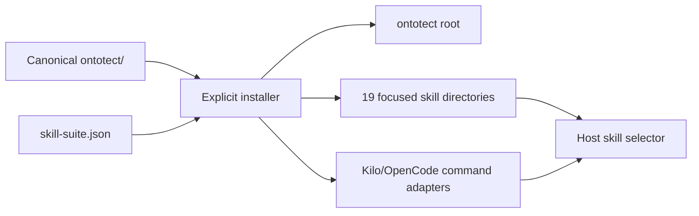

# Architecture

[简体中文](../zh-CN/architecture.md) · [Documentation home](index.md)

Ontotect is a compiled Agent Skill Suite, not a standalone ontology platform.
The source tree holds one canonical workflow and one 20-entry registry. The
installer generates independently discoverable, self-contained focused skills;
each Agent then progressively loads only the references needed for its request.

The repository root also contains a distribution adapter:

```text
package.json              # npm identity, executable mapping, and package allowlist
bin/ontotect.js           # dependency-free list/plan/install compiler
ontotect/                 # canonical portable Agent Skill package
docs/                     # bilingual public documentation and decisions
tests/                    # repository, Python, and npm regression checks
```

The root CLI copies the canonical skill and compiles focused entry points. It
does not maintain separate handwritten ontology workflows.

## Package layers

```text
ontotect/
├── SKILL.md                 # trigger, operating contract, routing, lifecycle, output contract
├── agents/openai.yaml       # optional host UI metadata
├── references/              # command specifications and ontology-engineering knowledge
├── assets/
│   ├── skill-suite.json     # focused skill and command registry
│   ├── command-adapter.md   # thin Kilo/OpenCode adapter template
│   └── ...                  # briefs, CQs, fixtures, shapes, reports, release records
└── scripts/
    ├── ontotect.py          # deterministic command navigator; guidance only
    ├── install_skill.py     # dry-run-first multi-host installer
    ├── ontology_audit.py    # advisory RDF/OWL structure and optional SHACL audit
    └── ontology_diff.py     # asserted RDF graph diff
```

`SKILL.md` stays compact enough to establish behavior and route references. Detailed knowledge remains under `references/` so an Agent does not load the entire ontology-engineering corpus for every task.

## Suite compilation



For each focused entry, the installer copies the ontology-engineering payload,
generates name-matching `SKILL.md` frontmatter and a fixed-command preamble, and
generates `agents/openai.yaml`. The nested distribution installer is omitted
because only the canonical root is an installation source. The npm archive
therefore stays compact while installed focused entries remain operationally
self-contained.

## Command layer

The public protocol is `Use Ontotect. Command: <command>. Target: <target>.` The core contract defines authorization, visible work state, evidence semantics, and composition. Per-command references define help, routing, status, modes, release, and stages.

The router selects a primary mode and lifecycle entry point. It may be invoked explicitly or automatically when a matching request is ambiguous. Router output is a plan card, not permission, evidence, or a hidden chain-of-thought transcript.

The semantic protocol is recorded in [ADR 0001](../decisions/0001-portable-command-router.md);
focused discovery and host adapters are recorded in
[ADR 0004](../decisions/0004-host-discovery-and-command-adapters.md).

## Distribution adapter

`bin/ontotect.js` exposes `help`, `list`, `plan`, and `install` for five fixed
host layouts. It uses only Node.js standard-library APIs and performs no network
requests. `list` projects the registry; `plan` is read-only; `install` compiles
the suite. Package acquisition has no lifecycle side effects. A global
preflight blocks all writes when any Ontotect-owned target exists without
`--force`, rejects symlink/junction escape and wrong target types, and reports
both lexical and resolved destinations. Installation first builds every output
in sibling staging paths, then commits the set with rollback backups. A small
path-only state file in each canonical root lets an explicit `--force` perform a
clean managed refresh and remove previously managed entries that no longer
belong to the selected suite; unknown sibling skills are preserved.

The npm `files` allowlist keeps the private corpus, extraction output, tests, and local state outside the package. The distribution decision and threat model are [ADR 0002](../decisions/0002-explicit-npm-installer.md) and the [npm installer security review](npm-installer-security-review.md).

## Agent protocol versus Python navigator

The Agent protocol instructs a capable host Agent to inspect artifacts, reason, use approved tools, create authorized changes, and report evidence. The Python navigator `scripts/ontotect.py` only parses a command and emits a deterministic help, route, stage, or work card. It deliberately does not call an Agent or execute ontology engineering.

This separation provides a portable human/Agent interface without pretending that all hosts share one plugin or slash-command API. It also makes routing inspectable from a terminal without granting file or network authority.

## Evidence-producing tools

The other scripts have narrow contracts:

- `ontology_audit.py` parses RDF, reports structural smells, and can delegate SHACL to pySHACL when available. It is not a complete OWL reasoner or profile checker.
- `ontology_diff.py` compares asserted RDF graphs independent of triple order and blank-node labels. Inferred hierarchies, CQs, SHACL results, mappings, and operational metrics require separate comparison.
- `install_skill.py` plans or compiles the suite into host discovery roots.
  Installation does not prove runtime discovery or behavior.
- The Node installer offers the same roots, suite modes, adapter mapping, and
  structural-only evidence boundary for npm/npx users.

## Data and trust boundaries

Ontology files, imported vocabularies, data, issue text, documentation, and web content are untrusted evidence. They cannot grant permission or override the skill contract. The host controls filesystem, command, network, package, and remote-resource permissions.

Private research sources and extraction output remain outside the public
package. Generated installation mirrors are replaceable output;
`ontotect/` plus `skill-suite.json` are the sources of truth.

## Change synchronization

A behavioral command change must update its runtime command reference,
`SKILL.md` when routing changes, the suite registry when discovery changes, the
public command reference in both languages, relevant scenarios, and
verification. Public documentation never becomes an independent behavior
source.
