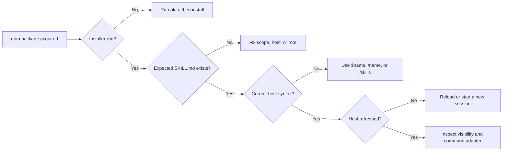

# Troubleshoot skill and slash discovery

[简体中文](../zh-CN/troubleshooting-discovery.md) · [Documentation home](index.md)

The fastest diagnosis is to identify which boundary failed:



## 1. Confirm that installation actually happened

`npm install --global @moonweave-ai/ontotect` installs the shell executable.
Publishing or downloading the package does not copy skills into Agent roots.
Public `0.1.1` also predates the focused-suite compiler: its installer creates
only the earlier `ontotect` root skill and has no `list`, `--suite`,
`--commands`, focused entries, or adapters. Missing `ontotect-review` after a
public `0.1.1` install is therefore expected, not a host discovery failure.

For the 20-entry checks below, use the current Ontotect source checkout or a
locally packed archive. From the checkout, preview a user-level full
installation:

```powershell
node bin/ontotect.js plan --agents all --scope user
```

The plan should show five core targets, five groups of 19 generated skill
entries, and Kilo/OpenCode command groups with 20 files each. Apply the exact
reviewed plan:

```powershell
node bin/ontotect.js install --agents all --scope user
```

If the current checkout was installed with `npm install --global .`, the same
commands can be run as `ontotect plan` and `ontotect install`. Use `--suite
core` only if a one-entry installation is intentional.

## 2. Check one exact discovery file

For a full user install, representative files are:

| Host | Expected review entry |
|---|---|
| Cursor | `~/.cursor/skills/ontotect-review/SKILL.md` |
| Codex | `~/.agents/skills/ontotect-review/SKILL.md` |
| Kilo | `~/.kilo/skills/ontotect-review/SKILL.md` |
| OpenCode | `~/.config/opencode/skills/ontotect-review/SKILL.md` |
| Claude Code | `~/.claude/skills/ontotect-review/SKILL.md` |

The containing directory and frontmatter `name` must both be
`ontotect-review`. The file must have a non-empty `description`. The generated
entry should also contain `references/`, `assets/`, `scripts/`, and
`agents/openai.yaml`.

If only a separate `ontology/` directory exists, Ontotect is still absent;
those are different skills.

## 3. Use the correct host syntax

| Host | Correct first checks |
|---|---|
| Codex CLI / IDE | `$ontotect-help`, `$ontotect-review`, then `/skills` |
| Codex Desktop | Type `$` to select a skill; enabled skills may also appear in the slash selector |
| Cursor | `/ontotect-help` or `/ontotect-review` |
| Claude Code | `/ontotect-help` or `/ontotect-review` |
| Kilo | `/ontotect-help` through the generated `.kilo/commands/` adapter; native skill loading does not itself define that slash command |
| OpenCode | `/ontotect-help` through the installed command adapter on stable releases |

Codex does not publish a portable `/ontotect-review` custom-command contract.
Do not diagnose `$ontotect-review` as missing merely because direct slash typing
does not behave like Cursor.

## 4. Refresh the host

- Cursor: reopen the project or start a new Agent session.
- Codex: changes are normally detected; restart the client if `/skills` remains
  stale.
- Kilo: run `/reload` or start a new session.
- OpenCode: exit and restart.
- Claude Code: changes under an existing skills directory are detected live.
  Restart only if the top-level `.claude/skills/` directory was created after
  the session began.

## 5. Inspect command compatibility output

For Kilo and OpenCode, a full default install also creates:

```text
<command-root>/ontotect.md
<command-root>/ontotect-help.md
<command-root>/ontotect-router.md
<command-root>/ontotect-review.md
...
<command-root>/ontotect-stage-release.md
```

Each file should load the identically named focused skill and contain
`$ARGUMENTS`. Cursor and Claude deliberately receive no duplicate legacy command
tree. Codex has no custom command target.

## 6. Inspect visibility controls

- Claude Code: use `/skills`; confirm the skill is enabled and no
  `skillOverrides: off` setting hides it.
- Cursor: inspect the product's Skills settings and ensure the project is the
  one containing the installed root.
- Codex: inspect `/skills`; if the files exist but the list remains stale,
  restart before treating it as a packaging defect.

## 7. Report the evidence level accurately

- File exists and validates: structural installation passed.
- Host lists or explicitly invokes the entry: live discovery passed.
- The focused command follows Ontotect's contract: behavioral smoke passed.

Do not use a successful install plan, file copy, or frontmatter parse as proof
of live-host behavior.
