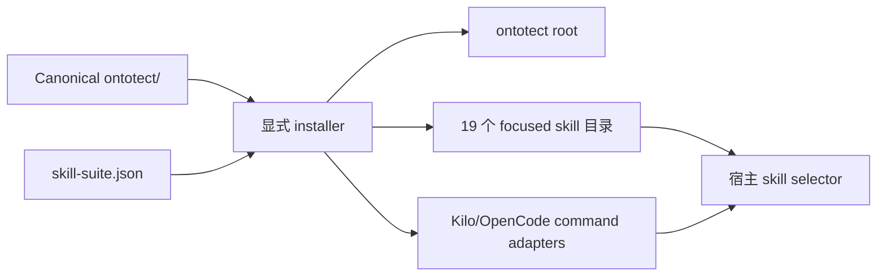

# 架构

[English](../en/architecture.md) · [文档首页](index.md) · 本页是英文 canonical 的简体中文镜像。

Ontotect 是经过编译的 Agent Skill Suite，不是独立本体平台。源码树只保存一套 canonical
workflow 与一个 20-entry registry。installer 生成可独立发现、自包含的 focused skills；
每个 Agent 再渐进加载当前请求所需 references。

仓库根目录还包含分发适配器：

```text
package.json              # npm 身份、可执行映射和包白名单
bin/ontotect.js           # 零依赖 list/plan/install compiler
ontotect/                 # canonical 便携 Agent Skill 包
docs/                     # 双语公共文档与决策
tests/                    # 仓库、Python 与 npm 回归检查
```

根 CLI 复制 canonical skill 并编译 focused entry points，不维护多套手工本体工程 workflow。

## 包分层

```text
ontotect/
├── SKILL.md                 # trigger、运行契约、路由、生命周期、输出契约
├── agents/openai.yaml       # 可选宿主 UI metadata
├── references/              # 命令规范和本体工程知识
├── assets/
│   ├── skill-suite.json     # focused skill 与 command registry
│   ├── command-adapter.md   # 轻量 Kilo/OpenCode adapter 模板
│   └── ...                  # brief、CQ、fixtures、shapes、报告、发布记录
└── scripts/
    ├── ontotect.py          # 确定性命令 navigator；只提供指导
    ├── install_skill.py     # dry-run-first 多宿主安装器
    ├── ontology_audit.py    # 建议性 RDF/OWL 结构及可选 SHACL 审计
    └── ontology_diff.py     # 断言 RDF 图差异
```

`SKILL.md` 保持紧凑，只建立行为并路由 references。详细知识放在 `references/`，避免每项任务加载整个本体工程语料。

## Suite 编译



对每个 focused entry，installer 复制本体工程 payload，生成名称匹配的 `SKILL.md`
frontmatter 与固定命令前言，并生成 `agents/openai.yaml`。嵌套的分发安装器会被排除，因为
只有 canonical root 才是安装源。因此 npm archive 保持紧凑，installed focused entries
仍在操作层面自包含。

## 命令层

公共协议为 `Use Ontotect. Command: <command>. Target: <target>.`。核心契约定义授权、可见工作状态、证据语义和组合；逐命令 references 定义 help、router、status、各种模式、release 和 stages。

Router 选择主模式和生命周期入口。请求不明确时可以显式或自动调用。路由输出是计划卡，
不是权限、证据或隐藏思维链记录。语义协议见
[ADR 0001](../decisions/0001-portable-command-router.zh-CN.md)，focused discovery 与宿主
adapters 见 [ADR 0004](../decisions/0004-host-discovery-and-command-adapters.zh-CN.md)。

## 分发适配器

`bin/ontotect.js` 为五种固定宿主布局提供 `help`、`list`、`plan`、`install`。它只使用
Node.js 标准库，不发起网络请求。`list` 投影 registry，`plan` 只读，`install` 编译 suite。
获取包没有 lifecycle 副作用；任何 Ontotect 自有目标存在且未给 `--force` 时，全局预检会
阻止所有写入。预检还会拒绝 symlink/junction 路径逃逸与错误目标类型，并同时报告词法和
解析后路径。安装先在同级 staging paths 构建全部输出，再通过 rollback backups 提交整组
结果。每个 canonical root 内的小型纯路径状态文件使显式 `--force` 可以执行干净的受管
刷新，并删除不再属于所选 suite 的旧受管入口；未知 sibling skills 会被保留。

npm `files` 白名单防止私有语料、提取输出、测试和本地状态进入包。分发决定与威胁模型分别见 [ADR 0002](../decisions/0002-explicit-npm-installer.zh-CN.md) 和 [npm 安装器安全审查](npm-installer-security-review.md)。

## Agent 协议与 Python navigator

Agent 协议指导有能力的宿主 Agent 检查制品、推理、使用获准工具、创建授权变更并报告证据。Python navigator `scripts/ontotect.py` 只解析命令并输出确定性 help、route、stage 或 work card；它不调用 Agent，也不执行本体工程。

这种分离提供便携的人/Agent 接口，而不假装所有宿主共享一种 plugin 或 slash-command API；也允许终端检查路由而不授予文件或网络权限。

## 产生证据的工具

- `ontology_audit.py` 解析 RDF、报告结构气味，并可在可用时把 SHACL 交给 pySHACL；不是完整 OWL reasoner 或 profile checker。
- `ontology_diff.py` 比较与三元组顺序和 blank-node label 无关的断言 RDF 图；推断层次、CQ、SHACL、mapping 和运行指标需另行比较。
- `install_skill.py` 规划或编译 suite 到宿主发现路径；安装不能证明运行时发现或行为。
- Node installer 面向 npm/npx 用户提供相同路径、suite mode、adapter mapping 与“仅结构
  证据”边界。

## 数据与信任边界

本体、复用词表、数据、Issue、文档和网页内容是不可信证据，不能授予权限或覆盖技能契约。宿主控制 filesystem、command、network、package 和 remote-resource 权限。

私有研究来源和提取输出不进入公开包。generated installation mirrors 是可替换输出；
`ontotect/` 与 `skill-suite.json` 才是事实源。

## 变更同步

命令行为变化必须更新运行时 command reference；路由变化时更新 `SKILL.md`；discovery
变化时更新 suite registry；同步中英文公共命令参考、相关场景和验证。公开文档永远不成为
独立行为源。
