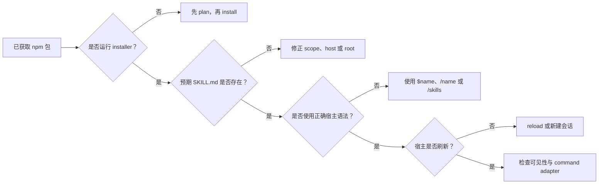

# 排查 Skill 与 Slash 发现问题

[English](../en/troubleshooting-discovery.md) · [文档首页](index.md) · 本页是英文 canonical 的简体中文镜像。

最快的诊断方式是先确定哪一道边界失败：



## 1. 确认安装确实发生

`npm install --global @moonweave-ai/ontotect` 安装的是 shell executable。发布或下载软件包
不会自动把 skills 复制到 Agent roots。
公开 `0.1.1` 也早于 focused-suite compiler：它的 installer 只创建早期的 `ontotect`
root skill，不提供 `list`、`--suite`、`--commands`、focused entries 或 adapters。因此，
通过公开 `0.1.1` 安装后没有 `ontotect-review` 属于预期结果，不是宿主 discovery 故障。

下列 20-entry 检查需要使用当前 Ontotect 源码 checkout 或本地 packed archive。在 checkout
中预览用户级完整安装：

```powershell
node bin/ontotect.js plan --agents all --scope user
```

计划应显示五个 core targets、五组各 19 个 generated skill entries，以及 Kilo/OpenCode
各 20 个 command files。应用完全相同、已审阅的计划：

```powershell
node bin/ontotect.js install --agents all --scope user
```

若已用 `npm install --global .` 全局安装当前 checkout，也可把相同命令写成 `ontotect plan`
与 `ontotect install`。只有明确希望安装单一入口时才使用 `--suite core`。

## 2. 检查一个精确发现文件

完整用户级安装的代表性文件：

| 宿主 | 预期 review entry |
|---|---|
| Cursor | `~/.cursor/skills/ontotect-review/SKILL.md` |
| Codex | `~/.agents/skills/ontotect-review/SKILL.md` |
| Kilo | `~/.kilo/skills/ontotect-review/SKILL.md` |
| OpenCode | `~/.config/opencode/skills/ontotect-review/SKILL.md` |
| Claude Code | `~/.claude/skills/ontotect-review/SKILL.md` |

所在目录和 frontmatter `name` 都必须是 `ontotect-review`，并具有非空 `description`。
generated entry 还应包含 `references/`、`assets/`、`scripts/` 和 `agents/openai.yaml`。

如果本机只有另一个 `ontology/` 目录，Ontotect 仍然没有安装；它们是不同 skills。

## 3. 使用正确的宿主语法

| 宿主 | 正确的首次检查 |
|---|---|
| Codex CLI / IDE | `$ontotect-help`、`$ontotect-review`，再检查 `/skills` |
| Codex Desktop | 输入 `$` 选择 skill；已启用 skills 也可能出现在 slash selector |
| Cursor | `/ontotect-help` 或 `/ontotect-review` |
| Claude Code | `/ontotect-help` 或 `/ontotect-review` |
| Kilo | 通过生成的 `.kilo/commands/` adapter 使用 `/ontotect-help`；原生 skill 加载本身不定义该 slash command |
| OpenCode | 稳定版通过已安装 command adapter 使用 `/ontotect-help` |

Codex 没有发布可移植的 `/ontotect-review` custom-command 契约。不能因为直接键入 slash 的
行为与 Cursor 不同，就判定 `$ontotect-review` 缺失。

## 4. 刷新宿主

- Cursor：重新打开项目或新建 Agent 会话。
- Codex：通常会自动检测；若 `/skills` 仍过期则重启客户端。
- Kilo：运行 `/reload` 或新建会话。
- OpenCode：退出并重新启动。
- Claude Code：已有 skills 目录中的变更会被热检测；只有会话启动后才新建顶层
  `.claude/skills/` 目录时才需重启。

## 5. 检查命令兼容输出

Kilo 与 OpenCode 的默认完整安装还会创建：

```text
<command-root>/ontotect.md
<command-root>/ontotect-help.md
<command-root>/ontotect-router.md
<command-root>/ontotect-review.md
...
<command-root>/ontotect-stage-release.md
```

每个文件都应加载同名 focused skill，并包含 `$ARGUMENTS`。Cursor 与 Claude 有意不安装重复
legacy command tree；Codex 没有 custom command target。

## 6. 检查可见性控制

- Claude Code：使用 `/skills`；确认 skill 已启用，且没有被 `skillOverrides: off` 隐藏。
- Cursor：检查产品的 Skills 设置，并确认当前项目正是包含安装 root 的项目。
- Codex：检查 `/skills`；如果文件存在但列表过期，先重启，再判断是否属于打包缺陷。

## 7. 准确报告证据层级

- 文件存在并通过结构验证：结构安装通过。
- 宿主列出或显式调用 entry：真实发现通过。
- focused command 遵循 Ontotect 契约：行为 smoke 通过。

不能把成功的安装计划、文件复制或 frontmatter 解析当作真实宿主行为证据。
